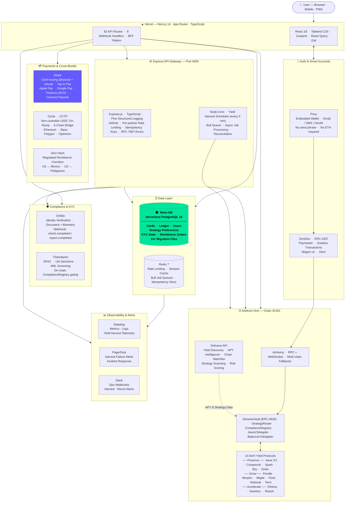

<div align="center">

# Genesis Reserve

**Institutional-grade treasury infrastructure for the stablecoin economy**

[](https://github.com/TheGenesisArchitect/genesis-reserve-smarter-wallet/actions/workflows/ci.yml)
[](https://arbiscan.io/)
[](https://www.circle.com/usdc)
[](https://neon.tech)
[](https://vercel.com)
[](LICENSE)

*Deposit USDC. Earn institutional yield. Move money globally — without a bank.*

</div>

---

## What Is Genesis Reserve?

Genesis Reserve is a full-stack treasury operating system that gives individuals and businesses access to the same yield infrastructure previously reserved for hedge funds and prime brokerages. Users connect with email or SMS, pass KYC, and deposit USDC. The protocol automatically allocates across 14 audited DeFi yield strategies, executes cross-chain transfers via Circle CCTP, and provides a Stripe-issued debit card backed by on-chain balance — all governed by on-chain compliance logic and a production-grade API gateway.

**The contracts are live on Arbitrum One mainnet.**

---

## Architecture



---

## Tech Stack

| Layer | Technology | Purpose |
|---|---|---|
| **Framework** | Next.js 14 (App Router) | Server components, streaming, BFF API routes |
| **Language** | TypeScript 5.5 | End-to-end type safety |
| **UI** | React 18 · Tailwind CSS · Zustand · React Query | Component state, server state, styling |
| **Validation** | Zod 4.x | Schema validation at API boundaries |
| **Auth** | [Privy](https://privy.io) v1.81 | Embedded wallet · email/SMS/OAuth · no seed phrase |
| **Smart Accounts** | [ZeroDev](https://zerodev.app) ERC-4337 | Paymaster · gasless transactions · batched ops |
| **Blockchain SDK** | Wagmi v2 · Viem · Ethers.js v5 | Ethereum bindings · contract interaction |
| **Network** | Arbitrum One (Chain 42161) | Sub-cent gas · native USDC · EVM-compatible |
| **RPC** | [Alchemy](https://alchemy.com) | RPC + WebSocket · multi-chain fallbacks |
| **Smart Contracts** | GenesisVault (ERC-4626) · StrategyRouter · ComplianceRegistry | On-chain vault · yield routing · KYC gating |
| **Yield Discovery** | [Deframe](https://deframe.io) | APY intelligence · chain watchlist · risk scoring |
| **DeFi Protocols** | Aave · Compound · Spark · Sky · Ondo · Pendle · Morpho · Ethena · Maple · Fluid · Notional · Term · Gearbox · Resolv | 14-protocol yield engine across 3 risk tiers |
| **Card Issuing** | [Stripe](https://stripe.com) Issuing | Physical + virtual debit cards |
| **Tap to Pay** | Stripe Payment Request · Apple Pay · Google Pay | In-app digital wallet payments |
| **Payouts** | Stripe Treasury (ACH) · Stripe Connect (instant card) | Dual payout paths |
| **USDC On-Ramp** | [Circle](https://circle.com) Payments API | Non-custodial · Genesis never holds USDC |
| **Cross-Chain** | Circle CCTP | Burns + re-mints native USDC · 6 chains · no bridge risk |
| **Remittance** | [Zero Hash](https://zerohash.com) | Regulated corridors · US↔MX · US↔PH |
| **KYC** | [Onfido](https://onfido.com) | Document + biometric identity verification |
| **AML / Sanctions** | [Chainalysis](https://chainalysis.com) | OFAC · UN sanctions · on-chain AML screening |
| **API Gateway** | Express.js · TypeScript | Per-partner auth · rate limiting · idempotency |
| **Logging** | Pino + Pino-HTTP | Structured JSON logs · colorized dev output |
| **Scheduling** | Node-Cron | Yield harvest (every 5 min) · reconciliation |
| **Job Queue** | Bull 4 (Redis-backed) | Async processing · retries · dead-letter |
| **Database** | [Neon DB](https://neon.tech) — Serverless PostgreSQL 16 | Cards · ledger · users · strategy prefs · KYC state |
| **Cache / Queue Store** | Redis 7 | Rate limiting · session cache · Bull job store |
| **Event Stream** | Kafka (optional) via KafkaJS | High-volume event pipeline (disabled by default) |
| **Hosting** | [Vercel](https://vercel.com) | Edge-deployed Next.js · auto-preview deployments |
| **Monorepo** | Turborepo 2 | Build orchestration · shared packages |
| **Metrics** | Datadog | Yield harvest telemetry · API latency · error rates |
| **Alerting** | PagerDuty + Slack | Harvest failure incidents · ops webhook notifications |
| **Testing** | Vitest · Mocha · Chai | Unit · integration · E2E test suites |

---

## Live Contracts — Arbitrum One

| Contract | Address | Explorer |
|---|---|---|
| **GenesisVault** (ERC-4626) | `0xb6D0e996d795dCc65Dc21341DAf6FDE991e49abd` | [Arbiscan ↗](https://arbiscan.io/address/0xb6D0e996d795dCc65Dc21341DAf6FDE991e49abd) |
| **StrategyRouter** | `0xD7ff8383eBBE3B1023d95A3f14c32D9941Ac9e84` | [Arbiscan ↗](https://arbiscan.io/address/0xD7ff8383eBBE3B1023d95A3f14c32D9941Ac9e84) |
| **ComplianceRegistry** | `0x6D58678562387c400964737884E78f2f12e1c495` | [Arbiscan ↗](https://arbiscan.io/address/0x6D58678562387c400964737884E78f2f12e1c495) |
| **AaveV3Adapter** | `0xa6F089338Ae75306217336054B36C02c3Bc5554D` | [Arbiscan ↗](https://arbiscan.io/address/0xa6F089338Ae75306217336054B36C02c3Bc5554D) |
| **BalancerV3Adapter** | `0x6291Ed9FC028F872D14B1da79de60a63e7Ec6624` | [Arbiscan ↗](https://arbiscan.io/address/0x6291Ed9FC028F872D14B1da79de60a63e7Ec6624) |
| **USDC (native Arbitrum)** | `0xaf88d065e77c8cC2239327C5EDb3A432268e5831` | [Arbiscan ↗](https://arbiscan.io/address/0xaf88d065e77c8cC2239327C5EDb3A432268e5831) |

---

## Repository Structure

```
genesis-reserve/
├── apps/
│   ├── api/                        # Express API Gateway — port 4000
│   │   ├── src/
│   │   │   ├── server.ts           # Entry point + middleware stack
│   │   │   ├── auth/               # Privy JWT + wallet identity verification
│   │   │   ├── config/             # DB pool (Neon), Redis, logger, event bus
│   │   │   ├── contracts/          # GenesisVault ABI + on-chain helpers
│   │   │   ├── cron/               # Yield harvest scheduler (Node-Cron + Bull)
│   │   │   ├── ledger/             # Transaction ledger service
│   │   │   ├── treasury/           # Vault ops, compliance, remittance, ZeroHash
│   │   │   └── webhooks/           # Onfido · Chainalysis · ZeroHash · Circle
│   │   ├── db/
│   │   │   └── migrations/         # 14+ PostgreSQL migration files
│   │   └── scripts/                # db-migrate · seed · emergency-drain
│   │
│   └── web/                        # Next.js 14 Frontend — Vercel
│       └── src/
│           ├── app/
│           │   ├── page.tsx         # App shell + panel router
│           │   └── api/gr/          # 82 BFF route handlers
│           │       ├── payments/    # Tap to Pay · Stripe intents
│           │       ├── cards/       # Stripe card issuing
│           │       ├── deposit/     # USDC deposit + strategy preference
│           │       ├── remittance/  # ZeroHash corridors
│           │       ├── cctp/        # Circle CCTP bridge relay
│           │       ├── kyc/         # Onfido KYC workflow
│           │       ├── vault/       # Vault ops + strategy data
│           │       ├── yield/       # Yield engine + performance
│           │       └── webhooks/    # Circle · Chainalysis · Onfido
│           ├── components/          # UI: wallet · deposit · yield · cards · analytics
│           ├── hooks/               # useGenesisVault · useYieldEngine · useCCTP · …
│           └── config/              # Privy · Wagmi · contract addresses
│
└── packages/
    └── types/                      # Shared TypeScript interfaces
```

---

## Quick Start

**Prerequisites:** Node 20+, Docker Desktop (for local Redis/Postgres), Git

```bash
git clone https://github.com/TheGenesisArchitect/genesis-reserve-smarter-wallet.git
cd genesis-reserve
npm install
```

**Configure environment:**
```bash
cp apps/api/.env.example apps/api/.env
cp apps/web/.env.example apps/web/.env.local
# Fill in: Alchemy key, Privy App ID, ZeroDev Project ID, Stripe keys
```

**Run locally:**
```bash
# Terminal 1 — API Gateway
cd apps/api && npm run dev

# Terminal 2 — Next.js Frontend
cd apps/web && npm run dev
```

**Verify:**
- Frontend: `http://localhost:3000`
- API health: `http://localhost:4000/health`
- Admin: `curl -H "x-admin-key: genesis-admin-dev-2026" http://localhost:4000/admin/stats`

---

## Key Engineering Decisions

**Why Arbitrum One?**
Sub-cent gas fees make micro-yield distributions economically viable. Native USDC (not bridged) eliminates bridge risk on the core asset.

**Why ERC-4626?**
The tokenized vault standard gives institutional integrators a standard interface and simplifies yield accounting — every share redemption is an atomic, auditable event.

**Why Privy over MetaMask?**
Embedded wallets with email/SMS login removes the single biggest DeFi onboarding drop-off: "I don't have a wallet." Users never see a seed phrase or pay gas.

**Why Circle CCTP over generic bridges?**
CCTP burns and re-mints native USDC — there is no bridge-custodied liquidity pool to drain. Circle provides the attestation service, eliminating the bridge operator trust assumption.

**Why Neon DB (serverless Postgres)?**
Neon's serverless branching model lets dev/staging environments spin up instant database copies without provisioning. The connection pooler handles Vercel's serverless concurrency patterns natively, and it scales to zero between requests — critical for a BFF layer with unpredictable traffic.

**Why Deframe for yield discovery?**
Rather than hardcoding protocol APYs, Deframe continuously scans on-chain yield sources across 9 chains, applies risk scoring, and feeds the StrategyRouter with live data. This lets the yield engine adapt without redeployment.

**Why Zero Hash for remittance (vs. Ripple / traditional rails)?**
Zero Hash is a regulated principal — they hold the money-transmitter licenses across 50 states, handle FX, and provide API access to settlement rails. Genesis integrates at the API layer without needing its own MTL.

---

## Roadmap

- [x] Smart contracts deployed on Arbitrum One mainnet
- [x] Privy embedded wallet + ERC-4337 gasless smart accounts
- [x] Express API gateway — ledger, KYC, remittance, compliance
- [x] Neon DB integration — serverless PostgreSQL for all persistence
- [x] Stripe card issuing — physical + virtual debit cards
- [x] Stripe Tap to Pay — Apple Pay + Google Pay via Payment Request API
- [x] Circle CCTP — non-custodial USDC on-ramp + 6-chain bridge
- [x] Zero Hash — regulated remittance corridors (US↔MX, US↔PH)
- [x] Onfido KYC + Chainalysis AML — full compliance pipeline
- [x] Deframe yield discovery — 14-protocol yield engine, 3 risk tiers
- [x] Yield Engine Strategy Center — earnings, positions, plan-ahead projections
- [x] Yield Monitor — live APY intelligence, market data, chain analytics
- [ ] First production user deposit → yield harvest → withdrawal cycle
- [ ] ZeroDev paymaster funded for production gasless UX
- [ ] Mobile PWA — home screen install, push notifications
- [ ] Institutional API partner onboarding

---

## Security

For responsible disclosure, see [SECURITY.md](SECURITY.md).
**Never commit private keys or `.env` files.** The `.gitignore` blocks all env files at every level.

---

## Contributing

See [CONTRIBUTING.md](CONTRIBUTING.md). All PRs require:
- TypeScript strict mode passing (`npm run typecheck`)
- No new `any` types without justification
- `Idempotency-Key` header on all state-changing API calls

---

## License

MIT — see [LICENSE](LICENSE)

---

<div align="center">
  <sub>Built by <a href="https://github.com/TheGenesisArchitect">TheGenesisArchitect</a> · Genesis Trust Group</sub>
</div>
