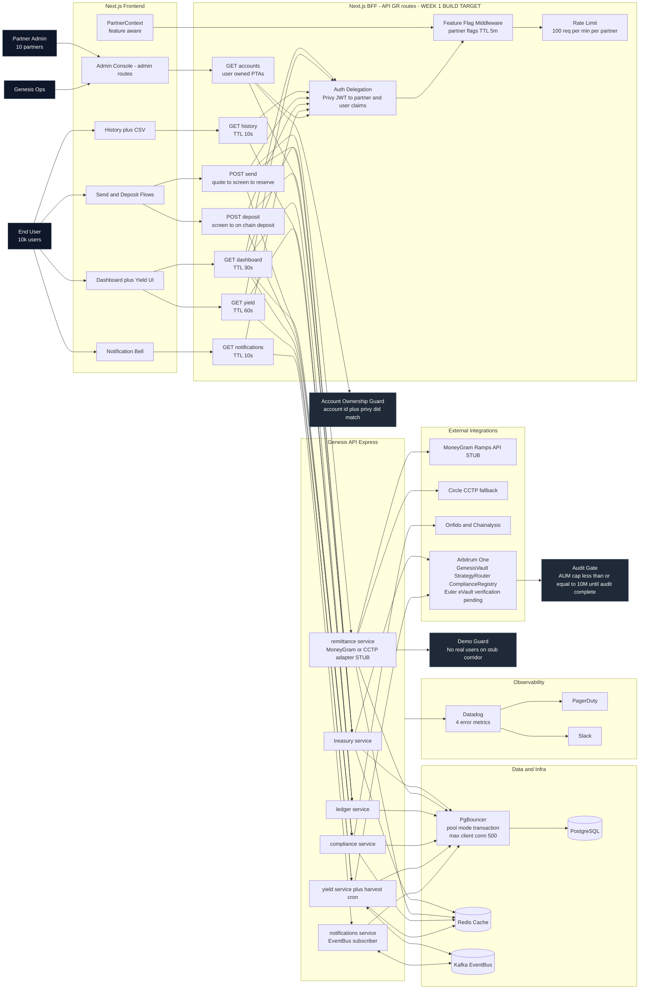

# Genesis Reserve MVP v2 — Interactive Architecture Diagram

This diagram reflects the validated engineering corrections from `genesis-mvp-scope-v2.docx` and aligns with `LAUNCH_MVP_SCOPE.md`.

## Architecture Sign-Off Status

**Decision**: Conditional approval (target-state accurate; launch sign-off pending closure of listed gates).

**Pre-launch sign-off gates (must be resolved):**
- `BFF /api/gr/*` aggregate layer + feature flags + account ownership guard are Week 1 build targets and not fully implemented yet.
- `MoneyGram` remains a stub in remittance flow and must stay blocked from real users until live provider wiring is complete.
- `Euler eVault` requires on-chain address verification in contracts + deploy pipeline before final launch stamp.
- Expanded MVP features promoted from backlog (analytics, scheduled sends, batch operations, invoicing, mobile apps, partner API, white-labeling, yield strategy selection, audit logs) must be launch-ready and approved in launch gates.

Execution checklists: `GO_NO_GO_CHECKLIST.md` and `GO_NO_GO_CHECKLIST_CANARY.md`

## Read This Diagram as an Implementation Contract

- **BFF is aggregate-first**: one UI request composes multiple backend calls in parallel.
- **Partner-aware UX**: feature flags are resolved in BFF and surfaced through `PartnerContext`.
- **Send flow is provider-safe**: MoneyGram/CCTP must be real integration or explicit DEMO mode (never exposed to real users).
- **Scale path is explicit**: PgBouncer + Redis + indexes are mandatory before 1,000-concurrency load testing.
- **Security + governance gates**: account ownership middleware and audit AUM cap are launch controls, not backlog items.

## Expanded MVP Scope (Now Launch-Day In Scope)

- `Advanced Analytics`: ROI tracking, yield breakdowns by strategy, risk heatmaps.
- `Scheduled Sends`: recurring remittance create/edit/cancel flows.
- `Batch Operations`: multi-recipient sends with correct ledger handling.
- `Invoicing`: payment request generation and lifecycle tracking.
- `Mobile Apps`: native iOS/Android launch support.
- `API for Partners`: authenticated, rate-limited programmatic access.
- `White-Labeling`: partner branding configuration at runtime.
- `Yield Strategy Selection`: Conservative/Balanced/Growth selection and persistence.
- `Audit Logs`: detailed admin action logs with actor/time/action/resource metadata.

## Endpoint-to-Cache Matrix (from reviewed specs)

| BFF Endpoint | Aggregate Calls | TTL |
|---|---|---|
| `GET /api/gr/dashboard` | balance + yield snapshot + compliance + epoch + recent tx | `30s` |
| `GET /api/gr/yield` | yield snapshot + allocations + epoch + harvest history | `60s` |
| `GET /api/gr/history` | ledger entries (paginated) | `10s` |
| `POST /api/gr/send` | quote -> compliance screen -> reserve/finalize | no cache |
| `POST /api/gr/deposit` | compliance screen -> on-chain deposit | no cache |
| `GET /api/gr/notifications` | notifications feed query | `10s` |
| `GET /api/gr/accounts` | user-owned treasury accounts for account switcher | `30s` |

## Critical Data Model Additions

- `partner_feature_flags(partner_id, feature, enabled, config, updated_at)`
- `notifications(notification_id, user_id, type, payload, read, created_at)`
- `api_idempotency_keys(key, partner_id, response, expires_at)`
- `partner_rate_cards(partner_id, corridor, tx_fee_bps, fx_spread_bps, min_amount, max_amount)`
- `admin_sessions(session_id, partner_id, created_at, expires_at, ip)`
